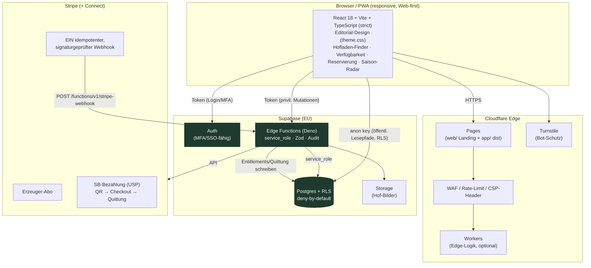
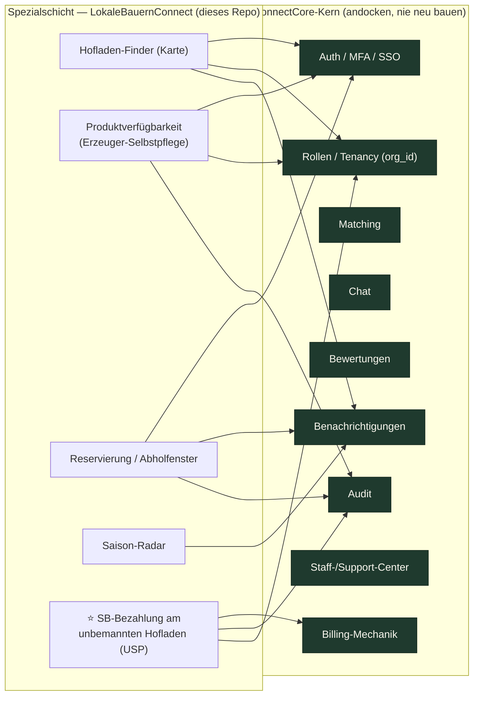
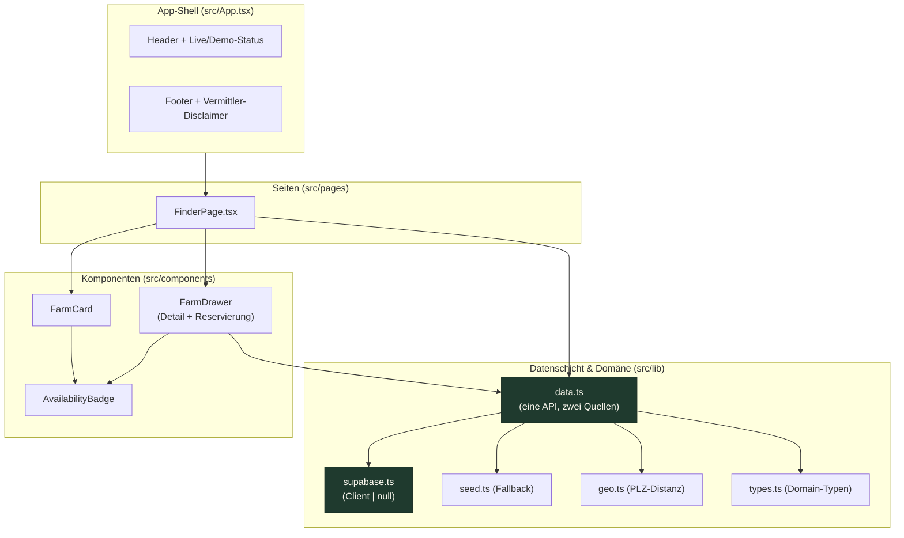
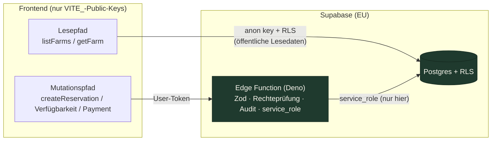
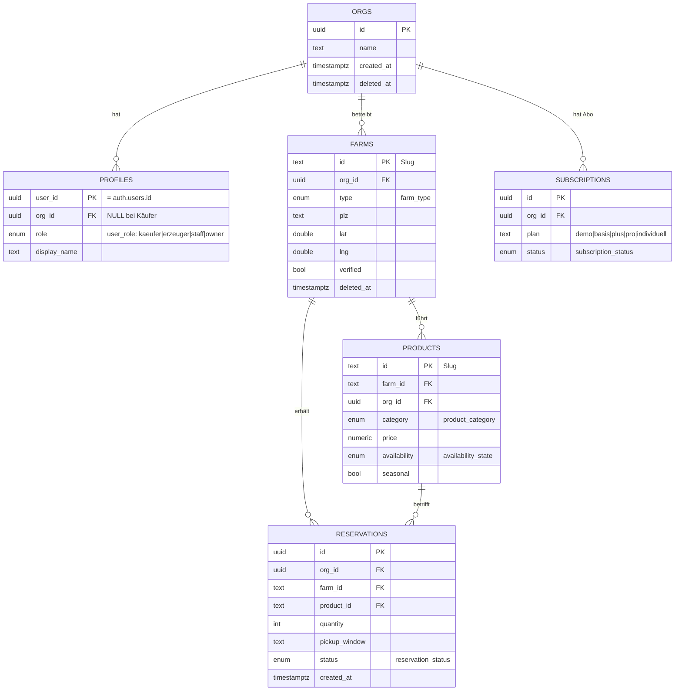
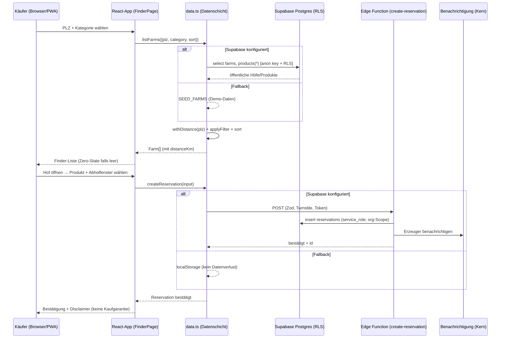
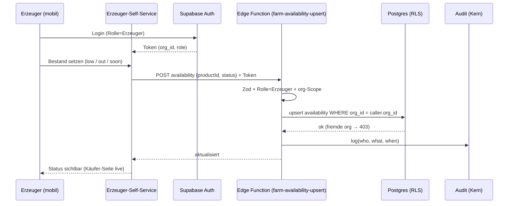
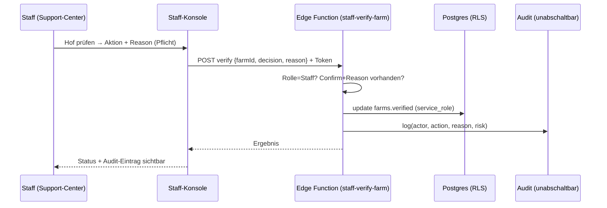
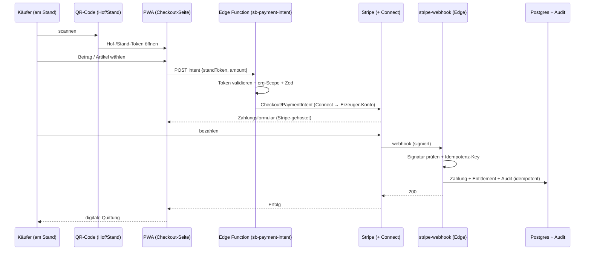
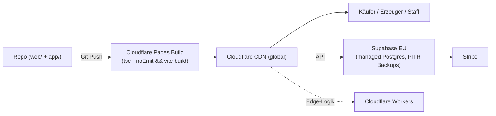

# LokaleBauernConnect — Architektur

> **Status:** Lebendes Dokument · Stand 2026-06-20 · Welle 1, Klasse C (ConnectCore-Imperium)
> **Verwandte Dokumente:** `docs/adr/0001-stack-react-supabase-cloudflare.md` · `docs/adr/0002-app-architektur-standalone-first.md` · `PHASEN.md` · `MASTER_INDEX.md` · `docs/DATABASE_MODEL.md` · `docs/ENTERPRISE_ARCHITECTURE.md` · `docs/ROLE_AND_PERMISSION_MODEL.md` · `docs/CORE_BUSINESS_STATE_MACHINES.md` · `docs/security/TENANT_ISOLATION_MODEL.md` (geplant)
> **Rolle der Plattform:** **Vermittler** — kein Eigenverkauf, keine Beratung. Disclaimer durchgängig sichtbar. Verkauf, Produktangaben und Verfügbarkeit liegen bei den Erzeugern.

Dieses Dokument beschreibt die System-Architektur von LokaleBauernConnect: die fixen Stack-Säulen (React/Vite/TypeScript · Supabase · Cloudflare · Stripe), die **Kern-vs-Spezialschicht**-Trennung des Imperiums, die Datenflüsse der drei Welten (Käufer · Erzeuger · Staff), den USP „sichere bargeldlose Bezahlung am unbemannten SB-Hofladen" sowie die reale Verzeichnisstruktur unter `app/`.

---

## 1. Systemübersicht

LokaleBauernConnect ist eine **serverless, managed** Plattform für regionale Lebensmittel direkt vom Hof. Es gibt **keinen selbst betriebenen Server, kein Docker-Self-Host, kein Hetzner** (ADR 0001). Stattdessen drei managed Säulen:

- **Edge & Auslieferung:** Cloudflare Pages (statisches Frontend + CDN), Cloudflare Workers (Edge-Logik wo nötig), Turnstile (Bot-Schutz öffentlicher Formulare), WAF (Schutzregeln, Rate-Limit).
- **Daten & Logik:** Supabase (EU-Region) — Postgres mit Row Level Security (RLS), Supabase Auth (MFA/SSO-fähig), Edge Functions (Deno) für privilegierte Server-Logik, Storage für Hof-Bilder.
- **Geld:** Stripe (+ Connect) — Erzeuger-Abo und der SB-Bezahl-USP (QR → Stripe → Quittung). **Ein** signaturgeprüfter, idempotenter Webhook ist die Wahrheit; Entitlements ausschließlich serverseitig.



**Lesepfad-Prinzip (entscheidend):** Öffentliche Lesedaten (Höfe, Produkte, Saison) liest das Frontend direkt aus Postgres über den **anon key** — abgesichert durch RLS-Policies (nicht durch den Client). **Jede privilegierte Mutation** (Reservierung mit Identitätsbezug, Verfügbarkeitspflege durch Erzeuger, Zahlungen, Staff-Aktionen) läuft über eine **Edge Function**, die als einzige den `service_role`-Key kennt, an der Grenze mit Zod validiert, Rechte prüft und ein Audit schreibt. **Der `service_role`-Key erscheint nie im Frontend** — dort nur `VITE_`-Public-Keys.

### 1.1 Ist-Zustand vs. Zielzustand (standalone-first, ADR 0002)

Die App ist **backend-agnostisch** gebaut: Die Datenschicht (`app/src/lib/data.ts`) bietet **eine API mit zwei Quellen** — Supabase (sobald `VITE_SUPABASE_*` gesetzt) **oder** realistische Seed-Daten als Fallback. Der Umstieg auf das echte Backend ist eine reine Konfigurationssache (Env + Tabellen), **kein Rewrite**. Der Statuspunkt im App-Header (`Live-Daten` / `Demo-Daten`) spiegelt diesen Modus ehrlich wider.

| Aspekt | Heute (spielbar, standalone) | Ziel (Enterprise-Premium) |
|---|---|---|
| Datenquelle | Seed-Daten (`lib/seed.ts`), Fallback automatisch | Supabase Postgres + RLS |
| Reservierung | `localStorage` bzw. Supabase-Insert | Edge Function + Audit + Benachrichtigung |
| Auth | noch keine (öffentlicher Finder) | Supabase Auth (Käufer/Erzeuger/Staff getrennt) |
| Verfügbarkeitspflege | — | Erzeuger-Self-Service (mobil), RLS-geschützt |
| Bezahlung | — | Erzeuger-Abo + SB-Bezahl-USP (Stripe) |
| Karte | PLZ-Distanz (Seed-Zentroide) | Leaflet/MapLibre (OSM), Pins, Cluster |

---

## 2. Kern vs. Spezialschicht (Imperium-Grundgesetz)

LokaleBauernConnect ist eine von 14 Tochter-Plattformen über **einem** geteilten ConnectCore-Kern. Die oberste Architektur-Regel: **Niemals in der Plattform bauen, was in den Kern gehört.** Die Plattform liefert ausschließlich die **Spezialschicht**; der Kern wird angedockt, nie dupliziert.



**Spezialschicht (hier gebaut):**
- **Hofladen-Finder** — Höfe in der Nähe, Öffnungszeiten, Filter nach Kategorie, PLZ-Distanz/Karte.
- **Produktverfügbarkeit** — saisonale Produkte, Bestandsstatus (`available`/`low`/`soon`/`out`), **Selbstpflege durch Erzeuger**.
- **Reservierung / Abholung** — Vorbestellen, wählbare Abholfenster, ohne Kaufgarantie.
- **Saison-Radar** — was gerade Saison hat; Alerts bei Lieblingsprodukten (Phase 4).
- **⭐ SB-Bezahlung (USP)** — sichere bargeldlose Zahlung am unbemannten Stand.

**Kern (nur andocken):** Auth/MFA/SSO · Rollen/Tenancy · Matching · Chat · Bewertungen · Billing-Mechanik · Benachrichtigungen · Staff-/Support-Center · Audit. Solange der Kern als geteiltes Paket (`packages/core` + `ui`) noch nicht existiert, ist die App **standalone-first** strukturiert, sodass sie später **ohne Rewrite absorbiert** werden kann (ADR 0002): `src/lib`, `src/components`, `src/pages` und die Editorial-Tokens (`src/styles/theme.css`) sind so geschnitten, dass `theme.css → packages/ui` und Auth/Billing → `packages/core` wandern können, sobald ≥2 Plattformen genug teilen.

---

## 3. Frontend-Architektur (React / Vite / TypeScript)

### 3.1 Technische Eckdaten

| Aspekt | Wert | Quelle |
|---|---|---|
| Framework | React 18.3 | `app/package.json` |
| Build/Dev | Vite 5.4, `@vitejs/plugin-react` | `app/vite.config.ts` |
| Sprache | TypeScript 5.5 **strict** | `app/tsconfig.json` |
| Build-Skript | `tsc --noEmit && vite build` (Typecheck **vor** Build) | `app/package.json` |
| Dev-Port | **5409** (5400 + Projektnr. #09; `strictPort:false`) | `app/vite.config.ts` |
| Build-Output | `app/dist/` → Cloudflare Pages | `app/vite.config.ts` |
| Externe Fonts | **keine** (System-Serife/Sans, DSGVO) | `app/src/styles/theme.css` |
| Mobile | eine responsive Codebasis → PWA | ADR 0001 |

### 3.2 Schichtenmodell der App



**Designprinzipien (verbindlich):**
- **Editorial-Design über Tokens** — keine hardcodierten Farben; alle Werte aus `theme.css` (`--paper`, `--forest`, `--wine`, `--gold`, semantische Verfügbarkeits-Tokens `--ok/--low/--soon/--out`). Magazin-/Papier-Anmutung, System-Serife, Gold-Mono-Eyebrows.
- **Keine Deko-Emojis** in produktiver UI (Editorial-Disziplin).
- **End-to-End-Pflicht** — ein Feature gilt erst fertig, wenn die Kette steht: erreichbarer Endpoint → realer Fetch → echtes DOM → Lade-/Leer-/Fehlerzustand → gebundener Handler → ggf. Refresh. Kein TODO, kein toter Button, kein Platzhalter.
- **Zero-State statt Error** — leere Daten zeigen „Noch keine Höfe/Produkte", nie einen Fehlerbildschirm.
- **Escaping** — alle Erzeuger-/Käufer-Werte (Hof-Story, Produktname, Kontakt) werden vor Ausgabe escaped; React escaped Text-Children by default, `dangerouslySetInnerHTML` ist verboten.

### 3.3 Domänen-Typen (Single Source of Truth, `src/lib/types.ts`)

Die TypeScript-Typen sind die **Quelle der Wahrheit** für das Spezial-Datenmodell und das spätere Supabase-Schema (ADR 0002):

- `Farm` — `id, orgId?, name, type, street, plz, city, lat, lng, story, openingHours, pickupWindows[], categories[], products[]`; Reputation `rating?, ratingCount?, reputationGrade?` (`'neu' | 'bronze' | 'silber' | 'gold'`); zur Laufzeit `distanceKm`.
- `Product` — `id, name, category, unit, price, availability, seasonal?`.
- `Availability` — `'available' | 'low' | 'soon' | 'out'` (DB-Enum `availability_state`).
- `Review` — `id, farmId, rating, authorName?, comment?, verified?, createdAt`.
- `ReservationInput` / `Reservation` — `farmId, orgId?, productId, quantity, pickupWindow, name, contact` (+ `id, createdAt`).
- `FarmApplicationInput` — `name, type, email, phone?, street, plz, city, categories[], story, openingHours, pickupWindows[]` (Erzeuger-Onboarding → `farm_applications`).
- `FarmFilter` — `plz?, category?, sort?` (`'distance' | 'name'`), `limit?`.

Beim Mapping auf Postgres gilt: `camelCase` (TS) ↔ `snake_case` (DB) — z. B. `farmId → farm_id`, `pickupWindow → pickup_window` (siehe `createReservation` in `data.ts`).

---

## 4. Backend-Architektur (Supabase)

### 4.1 Zwei Zugriffspfade — strikt getrennt



- **Lesepfad (direkt, RLS-gesichert):** `listFarms()` liest `farms` inkl. eingebetteter `products(*)` direkt über den anon key. RLS erlaubt öffentliche Höfe/Produkte read-only; alles andere ist deny-by-default.
- **Mutationspfad (über Edge Functions):** privilegierte Schreibvorgänge laufen ausschließlich über Edge Functions. Diese sind die **einzige** Stelle mit `service_role`, validieren Eingaben mit **Zod** an der Grenze, prüfen Rechte serverseitig, schreiben **Audit** und setzen bei öffentlichen Formularen **Turnstile** voraus.

### 4.2 Edge Functions (Deno) — Verantwortlichkeiten

| Funktion | Status | Aufgabe | Pflichten |
|---|---|---|---|
| `stripe-webhook` | ✅ vorhanden | **EIN** signaturgeprüfter, idempotenter Stripe-Handler (Idempotenz via `payment_events`) | Signaturprüfung, Idempotenz-Key, Entitlements serverseitig |
| `create-checkout` | ✅ vorhanden | Stripe-Checkout-Session erzeugen (Erzeuger-Abo / Zahlung) | Zod, org-Scope, service_role |
| `create-reservation` | ⬜ geplant | Reservierung mit Identitätsbezug anlegen | Zod, Rate-Limit, Turnstile, Audit, Benachrichtigung |
| `farm-availability-upsert` | ⬜ geplant | Erzeuger pflegt Bestand/Verfügbarkeit | Rolle=Erzeuger, org-Scope, Audit |
| `sb-payment-intent` | ⬜ geplant | SB-Bezahlung am Stand initiieren | QR-Token validieren, Stripe Checkout, Audit |
| `staff-verify-farm` | ⬜ geplant | Hof-Verifizierung / Eskalation (Staff) | Rolle=Staff, Confirm+Reason, Audit |

**Regeln (nicht verhandelbar):** kein langer Job in einer Edge Function (Timeout-Limits → Workers/Queues); keine sensible Route ohne serverseitigen Org-Scope; kein Webhook ohne Signaturprüfung; kein Geld-/Export-Pfad ohne Audit.

### 4.3 Datenmodell, RLS & Mandantenfähigkeit

Das vollständige Schema steht in `docs/DATABASE_MODEL.md`; hier der Architektur-Überblick. **SQL nur als neue, additive Migration** unter `app/supabase/migrations/`. Jede mandantengebundene Tabelle trägt `org_id` (Tenant) und **RLS deny-by-default ab Migration #1** (mit Plattform- **und** Org-Isolationstest); Zeitstempel/`deleted_at` je Tabelle (siehe `DATABASE_MODEL.md` §4). Der folgende ER-Auszug bildet das **real migrierte** Schema (0001–0004) ab: `farms.id`/`products.id` sind **`text`-Slugs** (kein UUID), `profiles`-PK ist `user_id`, der Plan liegt auf `subscriptions` (nicht `orgs`), und **Verfügbarkeit ist die Enum-Spalte `products.availability` — keine separate Tabelle**.



**Sieben Produktionspfeiler (Enterprise-Readiness ≥ 85 %) — architektonisch verankert:**
1. **Org-Boundary** — jede Query org-gebunden via RLS; fremde Org → 403, nie 200 mit Fremddaten.
2. **Zero-State statt Error** — leere Daten → `available:false` + leere Arrays; UI „Noch keine Daten".
3. **Scope-Transparenz** — Responses tragen `scope` (org/region/zeitraum); UI zeigt Kontext + Datenstand.
4. **RBAC ohne Lücken** — Käufer/Erzeuger/Staff sauber getrennt; Plan-Locks mit konkretem Upgrade-Pfad.
5. **Audit & Verantwortlichkeit** — jede Mutation: wer/was/warum (reason Pflicht bei kritischen Aktionen), unabschaltbar.
6. **Testpflicht pro Feature** — fremde Org = 403, leere Daten = Zero-State, valider Aufruf = erwartetes Shape.
7. **Drilldown-Integrität** — Deep-Links übergeben Kontext, bauen nie org-fremde URLs.

Kanonische Pläne (Imperium): `demo`, `basis`, `plus`, `pro`, `individuell`. „Enterprise" = Funktionsniveau in `individuell`, kein öffentlicher Plan.

---

## 5. Drei Welten — RBAC & Sessions

Käufer-, Erzeuger- und Staff-Welt sind **strikt getrennt** (Session/Berechtigung). Sichtbarkeit ist eine Backend-Wahrheit (RLS + Rollen), das Frontend spiegelt sie nur.

| Welt | Wer | Darf | Session-Trennung |
|---|---|---|---|
| **Käufer** | Verbraucher, Familien, regionale Gastronomie | Höfe finden, Verfügbarkeit sehen, reservieren, am SB-Stand zahlen | öffentlich + optional Konto |
| **Erzeuger** | Bauern, Hofläden, Imker, Hofmetzger, Manufakturen | eigenen Hof/Produkte/Verfügbarkeit pflegen, Reservierungen sehen, SB-Einnahmen/Schwund | nur eigene `org_id` |
| **Staff/Support** | Imperium-Staff-Center | Hof-Verifizierung, Eskalation, Support-Tickets | rollenbasiert, Confirm+Reason+Audit |

Plan-Locks zeigen immer einen konkreten Upgrade-Pfad (kein toter Hinweis). Staff-Aktionen sind nie ohne Audit.

---

## 6. Datenflüsse (Käufer · Erzeuger · Staff)

### 6.1 Käufer — Finden → Reservieren



*Heute (standalone):* `createReservation` schreibt bei fehlendem Backend nach `localStorage`, bestätigt aber immer — **kein toter Button**. *Ziel:* Edge Function mit Zod, Audit, Benachrichtigung.

### 6.2 Erzeuger — Verfügbarkeit selbst pflegen



### 6.3 Staff — Hof verifizieren / eskalieren



---

## 7. ⭐ USP — Sichere Bezahlung am unbemannten SB-Hofladen

Viele Hofläden sind unbesetzt (Vertrauenskasse). LokaleBauernConnect bietet **sichere bargeldlose Bezahlung am SB-Stand**: QR am Stand scannen → zahlen → Quittung. Das löst Schwund/Bargeld-Handling, senkt Käufer-Friktion und ist über eine kleine Transaktionsgebühr monetarisierbar. **Compliance: Plattform = Zahlungsanbindung/Vermittler, kein Eigenverkauf** (eigener ADR, Phase 4 Track A).



**Architektur-Garantien:** Stripe Connect leitet Geld an das Erzeuger-Konto (Plattform vermittelt nur); **ein** Webhook ist die einzige Wahrheit; Entitlements/Quittungen werden **serverseitig** geschrieben; Doppel-Zahlungen sind durch Idempotenz-Keys ausgeschlossen. Das Erzeuger-Dashboard zeigt Einnahmen/Schwund.

---

## 8. Sicherheit (defense-in-depth)

| Ebene | Maßnahme |
|---|---|
| **Edge (Cloudflare)** | WAF-Regeln, Rate-Limit, Turnstile auf öffentlichen Formularen, Security-Header (CSP, HSTS, X-Content-Type-Options, Referrer-Policy) |
| **Auth (Supabase)** | E-Mail/Passwort + MFA-fähig, SSO-fähig; getrennte Sessions Käufer/Erzeuger/Staff |
| **Daten (Postgres)** | RLS deny-by-default ab Migration #1; org-Scope auf jeder Tabelle; Soft-Delete (`deleted_at`); Plattform- + Org-Isolationstest |
| **Logik (Edge Functions)** | Zod-Validierung an jeder Grenze; serverseitige Rechteprüfung; `service_role` nur hier; Audit jeder Mutation |
| **Zahlungen (Stripe)** | EIN signaturgeprüfter, idempotenter Webhook; Entitlements serverseitig; Connect statt Eigeninkasso |
| **Frontend** | nur `VITE_`-Public-Keys; User-Werte escaped; keine Secrets im Code/Log; keine `dangerouslySetInnerHTML` |
| **Compliance** | Vermittler-Disclaimer durchgängig; Lebensmittel-Kennzeichnungs-Hinweis an Erzeuger; DSGVO (Datenexport/Löschung, EU-Hosting) |

**Nicht verhandelbare Verbote:** kein Fake-Data/Mock-KPIs in Prod-UI · kein unescaptes User-Input · kein stiller Fehler (`if(!orgId) return null` ohne 403) · keine hardcodierten Farben/Schwellwerte außerhalb Design-System · keine Secrets im Log · keine Migration ohne Rollback · keine Mutation ohne Audit · keine sensible Route ohne serverseitigen Org-Scope.

---

## 9. Betrieb, Deployment & Ausfallsicherheit (managed)

Kein Self-Host. Verfügbarkeit, Patching und Skalierung sind in die managed Säulen ausgelagert (ADR 0001).



- **Deployment:** `app/` baut zu `app/dist/` (Vite) → Cloudflare Pages; `web/` (Editorial-Landing) ebenfalls auf Pages. Release-Artefakt enthält **keine** Secrets, `.env` oder `.claude/`.
- **Skalierung 10 → 300 → 3000:** Skalierung = Konfiguration (managed). Architektur-Hebel: Indizes + Pagination (WAVE_11), Caching günstiger Lesepfade (Workers/CDN), N+1-Vermeidung, Karten-Cluster.
- **Ausfallsicherheit:** Supabase managed HA + Point-in-Time-Recovery; Cloudflare CDN/Edge global. Details: `docs/BACKUP_DISASTER_RECOVERY.md` + `docs/INCIDENT_RUNBOOK.md` (geplant).
- **Health/Monitoring:** Health-Checks + strukturierte Logs + Sentry (WAVE_13); Details: `docs/OBSERVABILITY.md` (geplant).
- **Secrets:** ausschließlich Env/Secret-Manager (Cloudflare/Supabase). Frontend nur `VITE_SUPABASE_URL` + `VITE_SUPABASE_ANON_KEY` (`app/.env.example`); `service_role` und Stripe-Secrets nur in Edge Functions.

---

## 10. Verzeichnisstruktur

### 10.1 Repo-Wurzel

```
09_LokaleBauernConnect(D)/
├── CLAUDE.md                 # Verbindliche Arbeitsanweisung (vor jeder Aktion lesen)
├── AGENTS.md                 # Harte Regeln + Subagenten-Roster
├── PHASEN.md                 # 5-Phasen-/Wellen-Bauplan
├── MASTER_INDEX.md           # Doku- & Bauplan-Landkarte (Soll-Struktur)
├── 00_BRIEFING.md            # Plattform-Steckbrief
├── 99_CHECKLISTE.md
├── README.md
├── web/                      # Editorial-Landing (statisch, Cloudflare Pages)
├── docs/                     # Dokumentation (dieses Verzeichnis)
│   ├── ARCHITEKTUR.md        # ← dieses Dokument
│   ├── adr/                  # Architecture Decision Records (0001, 0002, …)
│   └── releases/
│       └── PHASE_STATUS.md
└── app/                      # Plattform-App (React + Vite + TS)
```

### 10.2 App (`app/`) — Ist-Zustand (verifiziert)

```
app/
├── index.html                # Vite Entry HTML (#root)
├── package.json              # React 18 · Vite 5 · @supabase/supabase-js
├── tsconfig.json             # TypeScript strict
├── vite.config.ts            # Port 5409, outDir dist/, react()-Plugin
├── .env.example              # VITE_SUPABASE_URL / VITE_SUPABASE_ANON_KEY
├── dist/                     # Build-Output (Cloudflare Pages), gitignored
└── src/
    ├── main.tsx              # React-Root (StrictMode) + theme.css
    ├── App.tsx               # Shell: Header (Live/Demo-Status) + Footer (Disclaimer)
    ├── vite-env.d.ts
    ├── pages/
    │   └── FinderPage.tsx    # Hofladen-Finder (Filter, Liste, Drawer-Steuerung)
    ├── components/
    │   ├── FarmCard.tsx      # Hof-Kachel (Editorial)
    │   ├── FarmDrawer.tsx    # Hof-Detail + Produkte + Reservierung
    │   └── AvailabilityBadge.tsx  # Verfügbarkeits-Badge (Token-Farben)
    ├── lib/
    │   ├── data.ts           # Datenschicht: EINE API, zwei Quellen (Supabase|Seed)
    │   ├── supabase.ts       # Client (null wenn unkonfiguriert) + isSupabaseConfigured
    │   ├── seed.ts           # realistische Seed-Daten (Fallback)
    │   ├── geo.ts            # PLZ-Distanz, isValidPlz
    │   └── types.ts          # Domain-Typen (Source of Truth fürs Schema)
    └── styles/
        └── theme.css         # Editorial-Design-Tokens (keine externen Fonts)
└── supabase/                  # DB + Edge Functions (real vorhanden)
    ├── migrations/            # 0001_core · 0002_payments · 0003_marketplace · 0004_onboarding
    ├── functions/            # Edge Functions (Deno): stripe-webhook, create-checkout,
    │                         #   _shared/ (cors, supabaseAdmin, stripe, email)
    ├── seed.sql              # idempotenter SQL-Seed (deckungsgleich mit src/lib/seed.ts)
    ├── setup_all.sql         # One-Shot-Setup (Migrationen gebündelt)
    └── README.md
```

> **Hinweis:** Der `app/src`-Baum oben zeigt den Kern-Stand des Hofladen-Finders. Weitere real vorhandene Seiten/Komponenten (Erzeuger-Onboarding-Wizard, Self-Service, Staff-Konsole, Saison-Radar, SB-Korb, Auth-Gerüst, `/status`) sind über die Wellen hinzugekommen (siehe `docs/releases/PHASE_STATUS.md`) und hier aus Übersichtsgründen nicht einzeln gelistet.

### 10.3 App (`app/`) — Zielzustand (wächst über die Wellen)

```
app/
├── src/
│   ├── pages/                # + Erzeuger-Self-Service, Saison-Radar, SB-Checkout, Staff-Konsole
│   ├── components/           # + Karte (Leaflet/MapLibre), Wizard (datengetrieben/Zod)
│   ├── features/             # Spezialschicht-Bündel (finder, availability, reservation, sb-payment)
│   ├── lib/                  # + auth.ts, audit.ts, schema/ (Zod), api/ (Edge-Function-Clients)
│   └── styles/               # theme.css → später packages/ui absorbiert (ADR 0002)
└── supabase/
    ├── migrations/           # additive SQL-Migrationen (0001–0004 vorhanden), RLS deny-by-default + Isolationstest
    └── functions/            # Edge Functions (Deno) — vorhanden: stripe-webhook, create-checkout;
                              #   geplant: create-reservation, farm-availability-upsert,
                              #   sb-payment-intent, staff-verify-farm
```

> **Absorptionspfad (ADR 0002):** Sobald ≥2 Plattformen genug teilen, wandern `theme.css → packages/ui` und Auth/Billing → `packages/core`; `app/` zieht ohne Rewrite in den geteilten Workspace.

---

## 11. Offene Architektur-Aufgaben (verfolgt in PHASEN.md / MASTER_INDEX.md)

| Aufgabe | Welle | Doku |
|---|---|---|
| Supabase-Schema `orgs, profiles, farms, products, availability, reservations` + RLS + Isolationstest | WAVE_02 | `docs/DATABASE_MODEL.md` |
| RBAC Käufer/Erzeuger/Staff serverseitig | WAVE_03 | `docs/ROLE_AND_PERMISSION_MODEL.md` |
| Supabase Auth + Turnstile + Rate-Limits | WAVE_06 | `docs/security/IDENTITY_MODEL.md` |
| Stripe-Abo (Erzeuger) + Webhook | WAVE_09 | `docs/STRIPE-SETUP.md` |
| Cloudflare-Deploy + Security-Header + Domain | Phase 2 | `docs/DEPLOYMENT.md` |
| SB-Bezahl-USP (QR → Stripe → Quittung) | Phase 4 Track A | `docs/spezialmodule/SB_BEZAHLUNG_USP.md` + eigener ADR |
| Interaktive Karte (Leaflet/MapLibre, OSM) | Phase 4 Track B | `docs/spezialmodule/HOFLADEN_FINDER.md` |

---

*Dieses Dokument folgt der Soll-Struktur aus `MASTER_INDEX.md` (Abschnitt 1 · Architektur) und ist mit dem realen Code unter `app/` verifiziert. Architektur-Entscheidungen werden als ADR unter `docs/adr/` festgehalten; bei Konflikt gilt die Hierarchie User > AGENTS.md > Subagent > CLAUDE.md.*
