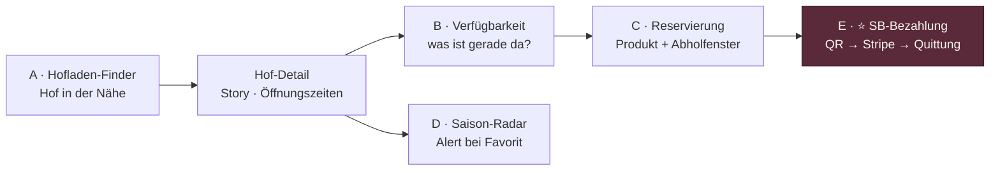
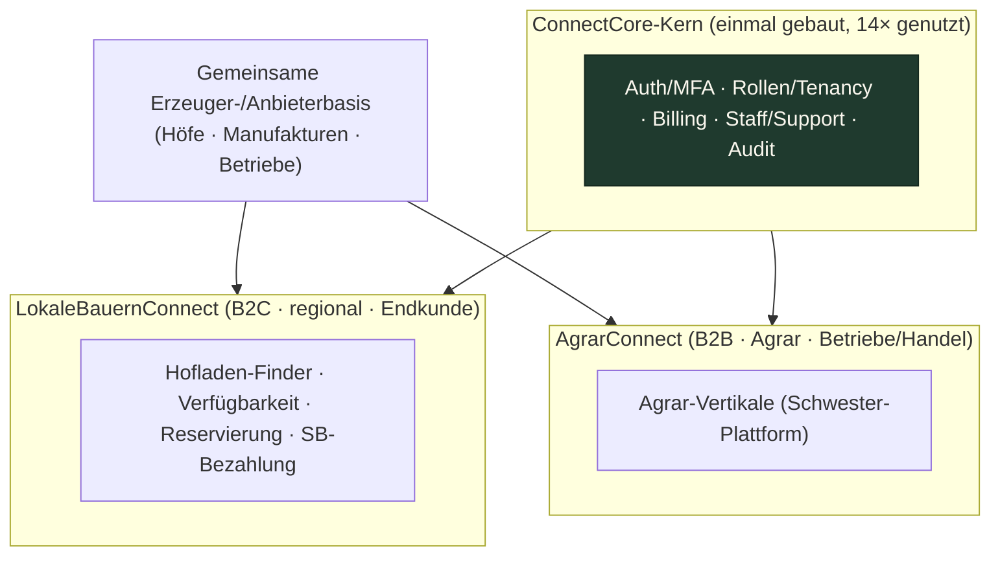

# PLATFORM_OVERVIEW — LokaleBauernConnect

> **Status:** Lebendes Dokument · Stand 2026-06-19 · Welle 1, **Klasse C** (Cashflow-Schnellstarter) im **ConnectCore-Imperium** (Plattform #09).
> **Claim:** *Regional direkt vom Hof — finden, reservieren, abholen.*
> **Rolle der Plattform:** **Vermittler** — kein Eigenverkauf, keine Beratung, keine Lebensmittel-Haftung. Disclaimer durchgängig sichtbar.
> **Verwandte Dokumente:** `00_BRIEFING.md` (Steckbrief) · `docs/ARCHITEKTUR.md` (System-Architektur) · `docs/ROLE_AND_PERMISSION_MODEL.md` (RBAC) · `docs/DATABASE_MODEL.md` (Schema) · `PHASEN.md` (Bauplan) · `MASTER_INDEX.md` (Doku-Landkarte) · `docs/adr/0001-stack-react-supabase-cloudflare.md` · `docs/adr/0002-app-architektur-standalone-first.md`
> **Zielgruppe dieses Dokuments:** Owner, Vertrieb, neue Claude-Sessions, Partner. Es ist die **eine** Stelle, die das *Was* und *Warum* der Plattform vollständig erklärt — das *Wie* (Stack, RLS, Schema, Wellen) steht in den verlinkten Dokumenten.

Dieses Dokument gibt den vollständigen Produktüberblick von LokaleBauernConnect: das Problem, die zwei Zielgruppen (Käufer · Erzeuger) und ihre Jobs-to-be-Done, das Wertversprechen, die Module der Spezialschicht, den USP „sichere bargeldlose Bezahlung am unbemannten Selbstbedienungs-Hofladen", die strikte Abgrenzung als **Vermittler** sowie die strategische Synergie mit der Schwester-Plattform **AgrarConnect** im ConnectCore-Imperium.

---

## 1 · In einem Satz

**LokaleBauernConnect verbindet regional-bewusste Käufer mit Höfen, Hofläden und Erzeugern in ihrer Nähe** — finden auf der Karte, Verfügbarkeit in Echtzeit (vom Erzeuger selbst gepflegt), vorbestellen mit Abholfenster, und am unbemannten Selbstbedienungs-Stand **sicher bargeldlos bezahlen** (QR → Stripe → digitale Quittung). Die Plattform **vermittelt** ausschließlich; Verkauf, Produktangaben, Preise und Verfügbarkeit liegen bei den Erzeugern.

---

## 2 · Das Problem

Regionaler Direkteinkauf ist gesellschaftlich gewollt, aber digital schlecht erschlossen. Beide Marktseiten verlieren dadurch — und genau diese Doppel-Friktion löst die Plattform.

### 2.1 Käuferseite — „Ich will regional, finde aber nicht hin"

| Schmerzpunkt | Konsequenz heute |
|---|---|
| **Finden** | Höfe sind über Mundpropaganda, Zettel am Straßenrand oder verstreute Facebook-Seiten organisiert. Kein zentraler, kartenbasierter Finder „Hof in der Nähe". |
| **Verfügbarkeit** | Ob Erdbeeren, Eier oder Honig gerade da sind, weiß man erst **vor Ort** — oft nach vergeblicher Anfahrt. Kein verlässlicher Saison-/Bestandsstatus. |
| **Öffnungs-/Abholzeiten** | Hofläden haben unregelmäßige Zeiten; SB-Stände sind 24/7, aber das weiß der Käufer nicht. |
| **Bezahlung am SB-Stand** | Vertrauenskasse setzt **Bargeld** voraus. Wer keins dabei hat, kauft nicht. Friktion an der Kasse = entgangener Umsatz. |

### 2.2 Erzeugerseite — „Ich produziere gut, erreiche aber niemanden digital"

| Schmerzpunkt | Konsequenz heute |
|---|---|
| **Reichweite** | Kleine Höfe haben kaum digitale Sichtbarkeit; eine eigene Website/Shop lohnt sich für ein saisonales Sortiment nicht. |
| **Pflegeaufwand** | Bestand und Saison ändern sich täglich. Ohne einfaches mobiles Werkzeug bleibt jede digitale Angabe schnell veraltet — und damit wertlos. |
| **Planbarkeit** | Ohne Vorbestellung produziert/erntet der Erzeuger ins Blaue; Reservierungen mit Abholfenster schaffen Planungssicherheit ohne Lieferpflicht. |
| **Schwund & Bargeld-Handling am SB-Stand** | Unbemannte Stände leben von Vertrauen — Schwund (nicht bezahlte Ware), Falschgeld, Kassen-Diebstahl und der Aufwand des Bargeld-Zählens drücken die ohnehin schmale Marge. |

> **Kern-Erkenntnis:** Es ist **kein Logistik-, sondern ein Sichtbarkeits-, Aktualitäts- und Vertrauens-Problem.** Die Plattform digitalisiert genau diese drei Lücken — ohne in Verkauf, Lieferung oder Beratung einzugreifen (Vermittler-Rolle, §8).

---

## 3 · Zielgruppen

Die Plattform bedient **zwei** klar getrennte Marktseiten plus die interne Plattform-Welt (Staff/Owner). Käufer-, Erzeuger- und Staff-Welt sind **strikt getrennt** — Session und Berechtigung (vgl. `docs/ROLE_AND_PERMISSION_MODEL.md`).

### 3.1 Käufer (Nachfrageseite)

| Segment | Wer | Primärer Job-to-be-Done |
|---|---|---|
| **Regional-bewusste Verbraucher** | Einzelne, Paare, Pendler | „Zeig mir frische, regionale Lebensmittel in meiner Nähe — und ob sie gerade da sind." |
| **Familien** | Haushalte mit Wocheneinkauf | „Ich will planbar regional einkaufen, vorbestellen, einmal abholen." |
| **Regionale Gastronomie** | Restaurants, Cafés, Hofcafés | „Ich brauche eine verlässliche Quelle für saisonale regionale Ware in kleinen Mengen." |
| **Tourismus/Ausflügler** | Wochenend-Besucher der Region | „Welcher Hof lohnt einen Stopp, was hat er, wann hat er offen?" |

**Charakteristik:** mobil-first, ortsbezogen, spontan **und** planend. Käufer zahlen **nichts** an die Plattform (Vermittler-Prinzip, gesellschaftlicher Nutzen > Maximalmonetarisierung). Reservierung ist als **Gast** (ohne Konto, Turnstile-geschützt) möglich; ein optionales Konto schaltet Favoriten und Saison-Alerts frei.

### 3.2 Erzeuger (Angebotsseite)

| Segment | Wer | Primärer Job-to-be-Done |
|---|---|---|
| **Bauernhöfe** | Gemüse-, Obst-, Ackerbau, Tierhaltung | „Mach meinen Hof auffindbar und meinen aktuellen Bestand sichtbar — mit minimalem Aufwand." |
| **Hofläden** | Bemannte + unbemannte SB-Stände | „Reservierungen entgegennehmen und am SB-Stand **bargeldlos kassieren** ohne Schwund." |
| **Imker · Hofmetzger** | Spezialerzeuger | „Saisonale/limitierte Ware gezielt an Interessenten bringen." |
| **Regionale Manufakturen · Gärtnereien** | Verarbeiter (Marmelade, Käse, Saft …) | „Direktvertrieb-Reichweite ohne eigenen Online-Shop." |

**Charakteristik:** org-gebunden (1 Betrieb = 1 Tenant `org_id`; 1 Org kann mehrere `farms` haben — Hauptstand + Filiale). Erzeuger sind die **zahlende** Seite (schlankes Abo + optionale SB-Transaktionsgebühr). Sie pflegen ihr Sortiment, ihre Verfügbarkeit und ihre Abholfenster **selbst** — mobil, in Sekunden.

### 3.3 Plattform-Welt (intern, kein Markt)

| Rolle | Aufgabe |
|---|---|
| **Staff/Support** | Hof-Verifizierung, Eskalation, Support-Tickets — org-übergreifend im definierten Scope, jede Aktion auditiert (Confirm + Reason). |
| **Owner** | Oberste Steuerung: Pläne/Preise/Entitlements, Feature-Flags, plattformweite KPIs, Break-Glass. |

> Detaillierte Rechte/Sichtbarkeit je Rolle: `docs/ROLE_AND_PERMISSION_MODEL.md` (Permission-Matrix + RLS-Mapping).

---

## 4 · Wertversprechen

Ein Versprechen je Marktseite — und eines für die Region als Ganzes.

### 4.1 Für Käufer
> **„Regional, frisch, planbar — und ohne Bargeld-Stress."**
- **Finden statt suchen:** Höfe in der Nähe auf einen Blick (PLZ-Distanz heute, interaktive Karte ab Phase 4).
- **Echtzeit-Verfügbarkeit:** Bestands-/Saisonstatus (`verfügbar · knapp · bald · aus`) direkt vom Erzeuger — keine vergebliche Anfahrt.
- **Vorbestellen mit Abholfenster:** sichere Reservierung statt Zufall — **ohne** Kaufzwang (Vermittlung, kein Kaufvertrag).
- **Bargeldlos am SB-Stand:** QR scannen, zahlen, fertig — digitale Quittung inklusive (USP, §7).

### 4.2 Für Erzeuger
> **„Mehr Reichweite, weniger Pflegeaufwand, kein Schwund."**
- **Digitale Sichtbarkeit ohne eigene Website:** auffindbar im Finder, optional hervorgehoben (Premium-Listing).
- **Selbstpflege in Sekunden (mobil):** Bestand und Saison mit zwei Tipps aktuell halten — die Käuferseite ist sofort live.
- **Planbarer Vorlauf:** Reservierungen mit Abholfenster machen Ernte/Produktion planbar — ohne Lieferpflicht.
- **Sicheres Geld am unbemannten Stand:** bargeldlose Zahlung senkt Schwund und Bargeld-Handling; Einnahmen/Schwund transparent im Dashboard.

### 4.3 Für die Region (gesellschaftlicher Nutzen — Klasse-C-Story)
Kürzere Wege, höhere Wertschöpfung beim Erzeuger, gestärkte lokale Versorgung, Transparenz über Saison und Herkunft. Diese Story ist der **strategische Kern** von Klasse C: kleineres Umsatzpotenzial, aber **hoher gesellschaftlicher Nutzen, starke Erzähl-/Presse-Story und schneller Cashflow-Start** (`00_BRIEFING.md`, `CLAUDE.md` Mission).

---

## 5 · Module der Spezialschicht

LokaleBauernConnect ist **eine von 14 Tochter-Plattformen über einem geteilten ConnectCore-Kern**. Oberste Architektur-Regel: **niemals in der Plattform bauen, was in den Kern gehört.** Der Kern (Auth/MFA/SSO · Rollen/Tenancy · Matching · Chat · Bewertungen · Billing-Mechanik · Benachrichtigungen · Staff-/Support-Center · Audit) wird **angedockt, nie dupliziert**. **Neu** — und damit der Wert dieses Repos — ist ausschließlich die **Spezialschicht**:

| # | Modul | Was es leistet | Wer pflegt | Status (Stand 2026-06-19) |
|---|---|---|---|---|
| **A** | **Hofladen-Finder** | Höfe in der Nähe (PLZ-Distanz/Karte), Filter nach Kategorie, Öffnungszeiten, Hof-Detail mit Story | Plattform (Aggregation), Erzeuger (Stammdaten) | ✅ end-to-end (Seed-/Supabase-ready), Port 5409 |
| **B** | **Produktverfügbarkeit** | Saisonale Produkte + Bestandsstatus (`available · low · soon · out`), **Erzeuger-Selbstpflege** | Erzeuger (mobil) | ✅ Badge + Selbstpflege live (`ProducerPage` `/hof/:farmId`, `updateProductAvailability`); numerischer Bestand (`stock_qty`) noch geplant |
| **C** | **Reservierung / Abholung** | Vorbestellen eines Produkts, wählbares **Abholfenster**, Bestätigung — **kein** Kaufvertrag | Käufer (anlegen), Erzeuger (Eingang) | ✅ Flow end-to-end (localStorage-Fallback → Supabase-Insert) |
| **D** | **Saison-Radar** | „Was hat gerade Saison" + Alerts bei Lieblingsprodukten/Verfügbarkeit | Plattform (Aggregation), Käufer (Alerts) | 🔨 Saison-Anzeige live (`app/src/lib/season.ts` + Finder-Bar/Filter); Alerts + `season_calendar`-Tabelle geplant (Phase 4 Track C) |
| **E** | **⭐ SB-Bezahlung (USP)** | Sichere bargeldlose Zahlung am unbemannten Stand: QR → Stripe-Checkout → E-Mail-Quittung | Käufer (zahlt), Erzeuger (Empfänger) | ✅ Korb-Bezahlung live (`StandPayPage` `/stand/:farmId`, Edge `create-checkout` Modus `sb_basket` + `stripe-webhook`); Stripe Connect + Transaktionsgebühr geplant (Phase 4 Track A, eigener ADR) |

> **Verbot (Kanon):** Niemals VMS/TempConnect-Begriffe (Vendor Pool, Requisition, Einsatzportal, Stundenzettel, SCC, Hetzner) übernehmen — diese Plattform spricht ausschließlich die **Hof-Domäne**.

### 5.1 Modul-Zusammenspiel (Käufer-Reise)



Die Module bauen funktional aufeinander auf: **Finden → Detail → Verfügbarkeit → Reservieren → (am Stand) Bezahlen.** Saison-Radar bringt Käufer proaktiv zurück. Jedes Modul ist eigenständig nutzbar (Zero-State, Deep-Links) — kein Modul ist eine Sackgasse.

### 5.2 Datenträger der Module (Schema-Verweis)
Die Module ruhen auf den additiven Tabellen `orgs · profiles · org_members · org_locations · farms · products · reservations · waitlist · reviews · subscriptions · sb_payments · payment_events · bounties · credits_ledger · farm_applications · audit_log` (real angelegt in `app/supabase/migrations/0001_core.sql`–`0004_onboarding.sql`). Verfügbarkeit und Abholfenster sind **Spalten** (`products.availability`, `farms.pickup_windows`), keine eigenen Tabellen. Alle mandantenbezogenen Tabellen tragen `org_id` + Zeitstempel (`farms` zusätzlich `deleted_at`), **RLS deny-by-default ab Migration #1** mit Plattform- **und** Org-Isolationstest. Vollständiges Schema: `docs/DATABASE_MODEL.md` · RLS-Mapping: `docs/ROLE_AND_PERMISSION_MODEL.md §3`.

---

## 6 · Individuelle Formulare (datengetrieben)

Alle plattformspezifischen Eingaben sind **datengetrieben** (Schema + Zod), gerendert über eine gemeinsame Wizard-Komponente (heute lokal, später `packages/ui` nach ADR 0002). Validierung an **jeder** Eingangsgrenze — clientseitig zur UX, serverseitig (Edge Function, Zod) als Wahrheit.

| Formular | Seite | Pflichten |
|---|---|---|
| **Reservierungs-Formular** (Käufer) | Hof-Detail / Drawer | Produkt + Menge + Abholfenster + Kontakt · Turnstile (Gast) · Vermittler-Disclaimer sichtbar |
| **Angebots-/Sortiment-Formular** (Erzeuger) | Erzeuger-Self-Service | Produkt + Kategorie + Einheit + Preis + Saison-Flag · Rolle=Erzeuger · org-Scope |
| **Verfügbarkeits-Pflege** (Erzeuger) | Erzeuger-Self-Service (mobil) | Status-Wechsel `available/low/soon/out` · Audit |
| **Onboarding-Wizard** (Erzeuger) | Onboarding | Betriebsprofil + Rolle + Verifizierungs-Nachweise · Hof-Verifizierung vor Veröffentlichung |

> Keine hardcodierten Schwellwerte/Kategorien in der UI (Kanon-Verbot) — Kategorien und Limits sind datengetrieben (Seed/Entitlement-Tabelle).

---

## 7 · ⭐ USP — Sichere Bezahlung am unbemannten SB-Hofladen

Viele Hofläden sind **unbesetzt** (Vertrauenskasse). Das ist charmant, aber teuer: Schwund, Bargeld-Handling, Falschgeld, Kassen-Diebstahl. LokaleBauernConnect bietet **sichere bargeldlose Bezahlung am SB-Stand**:

```
QR am Stand scannen  →  Artikel/Betrag wählen  →  Stripe-Checkout (gehostet)  →  zahlen  →  digitale Quittung
```

### 7.1 Warum das der USP ist
- **Käufer-Friktion ↓:** kein Bargeld nötig → mehr abgeschlossene Käufe (auch spontan).
- **Erzeuger-Schwund ↓:** jede Entnahme ist bezahlt und nachvollziehbar; Einnahmen/Schwund im Dashboard.
- **Monetarisierbar:** kleine Transaktionsgebühr je SB-Zahlung — der **zweite Geldfluss** neben dem Erzeuger-Abo.
- **Differenzierend:** Reine Hof-Verzeichnisse gibt es; **bargeldlose SB-Kasse mit Quittung am unbemannten Stand** ist der kategoriedefinierende Vorsprung.

### 7.2 Architektur-Garantien (Compliance-fest)
- **Ist-Stand (live):** Der Bezahlweg läuft über **Stripe Checkout (gehostet)** via Edge Function `create-checkout` (Modus `sb_basket`); der Stand-Korb wird in `sb_payments` (Status `initiated`) angelegt, der Betrag **serverseitig** aus `products.price` neu berechnet (Client-Betrag wird nie übernommen).
- **EIN** signaturgeprüfter, **idempotenter** Webhook (`stripe-webhook`) ist die einzige Wahrheit: `checkout.session.completed` setzt `sb_payments.status='paid'`; Idempotenz über die Tabelle `payment_events` (Event-ID als PK). Quittung geht per E-Mail (`renderReceipt`/`sendEmail`).
- `sb_payments` ist nur über Edge Function (service role) beschreibbar; der Betrieb sieht ausschließlich **eigene** Transaktionen (RLS).
- **Geplant (Phase 4 Track A):** **Stripe Connect** (Geldfluss direkt aufs Erzeuger-Konto), Plattform-Transaktionsgebühr und **Plan-Gate** ab Plan `pro` (vgl. `ROLE_AND_PERMISSION_MODEL.md §5`). Heute läuft der Checkout ohne Connect/Gebühr/Plan-Gate.

> Sequenz-Diagramm + Edge-Function-Vertrag: `docs/ARCHITEKTUR.md §7`. Vollspezifikation: `docs/spezialmodule/SB_BEZAHLUNG_USP.md` + eigener ADR. Connect-Ausbau: **Phase 4 Track A**.

---

## 8 · Abgrenzung — die Plattform ist Vermittler

Die Vermittler-Rolle ist **nicht** nur ein Marketing-Wort, sondern ein durchgesetztes Produkt- und Compliance-Prinzip. Sie schützt das schlanke Geschäftsmodell (Klasse C: niedrige Compliance-Last) und die Haftungsposition.

| Die Plattform … | … und ausdrücklich nicht |
|---|---|
| **vermittelt** Kontakt zwischen Käufer und Erzeuger | verkauft **keine** Lebensmittel selbst (kein Eigenhandel) |
| stellt **Reservierung** (Vorbestellung) bereit | schließt **keinen** Kaufvertrag im Namen der Parteien |
| bietet **Zahlungsanbindung** am SB-Stand (Stripe Connect → Erzeuger) | **inkassiert nicht** selbst, ist nicht Zahlungsempfänger der Ware |
| zeigt **vom Erzeuger gepflegte** Produktangaben/Verfügbarkeit | **berät nicht**, garantiert **keine** Verfügbarkeit/Qualität/Preise |
| **weist** Erzeuger auf Lebensmittel-Kennzeichnungspflichten **hin** | übernimmt **keine** Lebensmittel-Haftung/Kennzeichnung |

**Durchsetzung im Produkt (kein Lippenbekenntnis):**
- **Disclaimer durchgängig sichtbar** auf reservierungs- und zahlungsnahen Surfaces (z. B. „Reservierung ist keine Kaufgarantie; Verkauf erfolgt durch den Erzeuger").
- **Keine** Aktion gibt der Plattform Eigenverkaufs-/Beratungsrechte (siehe Permission-Matrix: Staff/Owner reservieren und kaufen **nicht**).
- **Geldfluss** über Stripe Connect an den Erzeuger; die Plattform berührt Auszahlungsdaten nicht direkt (KYC bei Stripe).
- **Lebensmittel-Kennzeichnung** bleibt Erzeuger-Pflicht; die Plattform liefert nur den Hinweis (Onboarding + `docs/COMPLIANCE_MODEL.md`, geplant).

> **Stop-Regel (Kanon):** Public-Flow ohne Einwilligung, Finance/Export ohne Audit, oder unklarer Org-Scope → **nicht bauen**, minimalen Fix vorschlagen, Owner-OK abwarten. Recht/DSGVO: `docs/launch/B_rechtstexte/*` + `docs/COMPLIANCE_MODEL.md` (geplant).

---

## 9 · Synergie mit AgrarConnect

LokaleBauernConnect steht nicht allein, sondern profitiert von der **gemeinsamen Erzeuger-/Anbieterbasis** des ConnectCore-Imperiums — namentlich der Schwester-Plattform **AgrarConnect** (B2B-Agrarvertikale). Beide teilen denselben Kern (ein Auth-/Tenancy-/Billing-/Staff-Center) und überschneiden sich auf der Angebotsseite.



| Synergie-Hebel | Nutzen |
|---|---|
| **Geteilte Anbieterbasis** | Ein Erzeuger, der bereits B2B (AgrarConnect) gelistet ist, ist mit minimalem Aufwand auch B2C (LokaleBauernConnect) auffindbar — niedrigere Akquisekosten, schnellere Angebotsdichte. |
| **Geteilter Kern** | Auth, Tenancy, Billing-Mechanik, Staff-/Support-Center, Audit werden **einmal** gebaut und von beiden genutzt — Wirtschaftlichkeit (Imperium-Grundgesetz). |
| **Cross-Vermarktung** | Regionale Endkunden-Story (B2C) + agrarische Reichweite (B2B) verstärken sich in Presse/Vertrieb. |
| **Datenstandard** | Gemeinsame Domänen-/Kategorien-Standards (Hof-Domäne) reduzieren Pflegeaufwand für Erzeuger über beide Plattformen. |

> **Blueprint-Denken:** Jedes Muster, das hier entsteht (SB-Bezahlung, Verfügbarkeits-Selbstpflege, Hof-Finder), wird daraufhin geprüft, ob es in den **20 weiteren** Imperium-Projekten wiederverwendbar ist (`CLAUDE.md` Mission). Wiederverwendbarkeit + Wirtschaftlichkeit vor Eleganz.

---

## 10 · Geschäftsmodell (schlank, zwei Geldflüsse)

Bewusst zurückhaltend monetarisiert — **gesellschaftlicher Nutzen > Maximalmonetarisierung** (Klasse-C-Prinzip). **Käufer zahlen nichts.** Erzeuger sind die zahlende Seite.

| Geldfluss | Quelle | Mechanik | Welle |
|---|---|---|---|
| **Erzeuger-Abo** | Plan `basis → plus → pro → individuell` | Stripe-Abo, Entitlements serverseitig (Webhook) | WAVE_09 |
| **SB-Transaktionsgebühr ⭐** | je SB-Zahlung am unbemannten Stand | kleine Gebühr über Stripe Connect | Phase 4 Track A |

Funktions-/Limit-Staffelung (Betriebe, Produkte, Premium-Listing, Saison-Push, SB-Bezahlung): `docs/ROLE_AND_PERMISSION_MODEL.md §5` (Entitlement-Matrix) · `docs/PRICING.md` (geplant). Kanonische Pläne im Imperium: `demo · basis · plus · pro · individuell` („Enterprise" = Funktionsniveau in `individuell`, kein öffentlicher Plan).

---

## 11 · Enterprise-Readiness — die 7 Produktionspfeiler (produktseitig)

Wie sich die nicht-verhandelbaren Produktionspfeiler in der **Produkterfahrung** zeigen (technische Verankerung: `docs/ARCHITEKTUR.md §4.3`):

1. **Org-Boundary** — ein Erzeuger sieht **nur** die Reservierungen/Daten seiner Betriebe; fremde Org → 403, nie Fremddaten.
2. **Zero-State statt Error** — leerer Finder/leeres Sortiment zeigt „Noch keine Höfe/Produkte" + nächsten Schritt (z. B. CTA „Erstes Produkt anlegen"), nie einen Fehlerbildschirm.
3. **Scope-Transparenz** — jede datenführende Ansicht zeigt Kontext (Region/Zeitraum + Datenstand) und ehrlich „Live-Daten" vs. „Demo-Daten".
4. **RBAC ohne Lücken** — Käufer/Erzeuger/Staff/Owner sauber getrennt; Plan-Locks zeigen **konkreten** Upgrade-Pfad (funktionierender Deep-Link, kein toter Button).
5. **Audit & Verantwortlichkeit** — jede Mutation (Verfügbarkeit, Verifizierung, Storno durch Staff, SB-Zahlung) wird mit wer/was/warum protokolliert; `reason` Pflicht bei kritischen Aktionen.
6. **Testpflicht pro Feature** — fremde Org = 403, leere Daten = Zero-State, valider Aufruf = erwartetes Shape.
7. **Drilldown-Integrität** — Deep-Links (Hof, Produkt, Upgrade) tragen Kontext und bauen nie org-fremde URLs.

---

## 12 · Status & Roadmap (Kurzüberblick)

| Bereich | Stand |
|---|---|
| App-Fundament (`app/`, React+Vite+TS, Editorial-Design) | ✅ build grün |
| Modul A · Hofladen-Finder (Finder + Detail + Reservierung, Seed/Supabase-ready, Port 5409) | ✅ end-to-end |
| Modul C · Reservierung (Flow + Abholfenster) | ✅ end-to-end (Fallback → Edge Function) |
| Modul B · Verfügbarkeit (Selbstpflege mobil) | ✅ Badge + Selbstpflege live (`ProducerPage`); numerischer Bestand folgt |
| Modul E · SB-Bezahlung (USP, Korb-Checkout) | ✅ live (`StandPayPage` + `create-checkout`/`stripe-webhook`); Connect + Gebühr folgen (Phase 4 Track A) |
| Modul D · Saison-Radar | 🔨 Anzeige live (`season.ts` + Finder); Alerts folgen (Phase 4 Track C) |
| Datenmodell + RLS + Isolationstest · Auth · Billing | ⬜ WAVE_02/03/06/09 |
| Cloudflare-Deploy + Domain + Security-Header | ⬜ Phase 2 (Owner-Freigabe: Account/Kosten/Domain) |

**Doppel-Ziel:** (a) **sofort spielbar** (Finder→Reservierung läuft heute mit Seed-/Supabase-Daten) und (b) **Enterprise-Premium in Rekordzeit** (volle Tiefe diszipliniert über die Phasen/Wellen). Vollständiger Bauplan: `PHASEN.md` · Live-Status: `docs/releases/PHASE_STATUS.md` · Doku-Landkarte: `MASTER_INDEX.md`.

---

*Dieses Dokument folgt der Soll-Struktur aus `MASTER_INDEX.md` (Abschnitt 3 · Produkt & Spezialmodule) und ist mit dem realen Code unter `app/` sowie den Schwester-Dokumenten (`ARCHITEKTUR.md`, `ROLE_AND_PERMISSION_MODEL.md`) abgeglichen. Bei Konflikt gilt die Hierarchie User > AGENTS.md > Subagent > CLAUDE.md. Produkt-Scope-Änderungen sind Architektur-relevant → Owner-Freigabe + ADR.*
